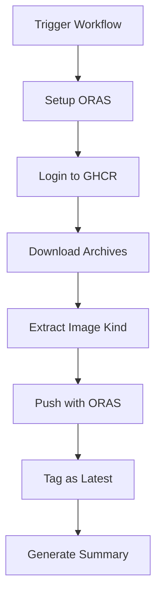
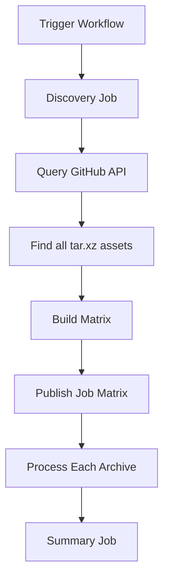

# GitHub Workflows Summary

This document provides an overview of the GitHub workflows created for publishing Tinkerbell Hook images as OCI artifacts.

## Workflows Created

### 1. `publish-hook-images.yml` - Static Archive List

**Location:** `.github/workflows/publish-hook-images.yml`

**Purpose:** Publishes Hook images using a predefined matrix of archive types.

**Key Features:**

- Uses a static matrix of common archive names (`hook-x86_64`, `hook-aarch64`, `hook-arm64`)
- Gracefully handles missing archives (continues if archive doesn't exist)
- Suitable when you know exactly which archives to publish
- Faster execution since the matrix is pre-defined

**Trigger:**

- Manual dispatch with `hook_version` input
- Push to main (for testing workflow changes)

**Usage:**

```bash
gh workflow run publish-hook-images.yml -f hook_version=v0.11.1
```

### 2. `publish-hook-images-dynamic.yml` - Dynamic Discovery

**Location:** `.github/workflows/publish-hook-images-dynamic.yml`

**Purpose:** Automatically discovers and publishes all `*.tar.xz` archives from a Hook release.

**Key Features:**

- Two-stage workflow: discovery then publishing
- Uses GitHub API to find all tar.xz assets in the release
- Handles any archive naming convention automatically
- Provides detailed summary of discovered archives
- No workflow updates needed when new archive types are added

**Trigger:**

- Manual dispatch with `hook_version` input
- Push to main (for testing workflow changes)

**Usage:**

```bash
gh workflow run publish-hook-images-dynamic.yml -f hook_version=v0.11.1
```

## Workflow Architecture

Both workflows follow this general pattern:



### Dynamic Workflow Specific



## Image Naming Convention

Archives are transformed into image references as follows:

```
Archive Name              → Image Reference
hook-x86_64.tar.xz       → ghcr.io/tinkerbell-community/hook-images/x86_64:v0.11.1
hook-aarch64.tar.xz      → ghcr.io/tinkerbell-community/hook-images/aarch64:v0.11.1
hook-lts.tar.xz          → ghcr.io/tinkerbell-community/hook-images/lts:v0.11.1
```

The transformation:

1. Remove `.tar.xz` extension
2. Remove `hook-` prefix (if present)
3. Use remainder as image kind
4. Combine with registry, repo, and version

## OCI Artifact Details

### Artifact Type

`application/vnd.tinkerbell.hook.layer.v1+tar`

### Media Type

`application/x-tar+xz`

### Annotations

Each published image includes these OCI annotations:

- `org.opencontainers.image.source`: `https://github.com/tinkerbell/hook`
- `org.opencontainers.image.version`: The Hook version (e.g., `v0.11.1`)
- `org.opencontainers.image.created`: ISO 8601 timestamp
- `org.opencontainers.image.description`: Descriptive text

## Permissions Required

The workflows require these GitHub permissions:

```yaml
permissions:
  contents: read      # To checkout repository
  packages: write     # To push to GHCR
```

These are automatically provided by `GITHUB_TOKEN` in workflow runs.

## Environment Variables

### `HOOK_VERSION`

The Tinkerbell Hook version to process. Can be:

- Provided as workflow input: `${{ inputs.hook_version }}`
- Falls back to default: `v0.11.1`

### `REGISTRY`

The OCI registry: `ghcr.io`

### `IMAGE_PREFIX`

The full image prefix: `ghcr.io/${{ github.repository }}`

Resolves to: `ghcr.io/tinkerbell-community/hook-images`

## Job Steps Breakdown

### Static Workflow Jobs

#### Main Job: `publish`

1. **Checkout repository** - Gets workflow code
2. **Set up ORAS** - Installs ORAS CLI
3. **Login to GHCR** - Authenticates with GitHub token
4. **Download archive** - Fetches tar.xz from Hook release
5. **Extract image kind** - Parses archive name
6. **Push with ORAS** - Publishes to GHCR
7. **Generate summary** - Creates job summary

#### Supporting Job: `list-available-archives`

- Lists all archives in the release for reference
- Helps verify what's available

### Dynamic Workflow Jobs

#### Job 1: `discover-archives`

1. **Query GitHub API** - Fetches release information
2. **Filter assets** - Finds all `*.tar.xz` files
3. **Build matrix** - Creates JSON array for next job
4. **Generate summary** - Lists discovered archives

#### Job 2: `publish` (Matrix Strategy)

Runs in parallel for each discovered archive:

1. **Checkout repository**
2. **Set up ORAS**
3. **Login to GHCR**
4. **Download archive**
5. **Determine image kind**
6. **Push to GHCR**
7. **Tag as latest** (optional)
8. **Generate summary**

#### Job 3: `summary`

- Aggregates results
- Creates final summary

## Error Handling

### Static Workflow

- Uses conditional checks (`if: steps.download.outputs.exists == 'true'`)
- Skips subsequent steps if archive doesn't exist
- Allows workflow to succeed even if some archives are missing

### Dynamic Workflow

- Uses `fail-fast: false` in matrix strategy
- Individual archive failures don't stop other archives
- Provides comprehensive error reporting

## Testing Workflows

### Test Workflow Changes

Both workflows trigger on push to main when their file changes:

```yaml
on:
  push:
    branches:
      - main
    paths:
      - '.github/workflows/publish-hook-images*.yml'
```

### Manual Testing

```bash
# Test with a known version
gh workflow run publish-hook-images-dynamic.yml -f hook_version=v0.11.1

# Test with different version
gh workflow run publish-hook-images-dynamic.yml -f hook_version=v0.10.0
```

## Monitoring Workflows

### View Running Workflows

```bash
gh run list --workflow=publish-hook-images-dynamic.yml
```

### Check Workflow Status

```bash
gh run view <run-id>
```

### View Workflow Logs

```bash
gh run view <run-id> --log
```

## Troubleshooting

### Common Issues

#### 1. Archive Not Found (404)

**Symptom:** Download step fails with 404
**Cause:** Archive doesn't exist in that release
**Solution:** Verify archive name at <https://github.com/tinkerbell/hook/releases>

#### 2. Authentication Failure

**Symptom:** Cannot push to GHCR
**Cause:** Insufficient permissions
**Solution:** Ensure workflow has `packages: write` permission

#### 3. Invalid Image Reference

**Symptom:** ORAS push fails with invalid reference
**Cause:** Image kind contains invalid characters
**Solution:** Update image kind extraction logic to sanitize names

#### 4. API Rate Limiting

**Symptom:** GitHub API calls fail with rate limit error
**Cause:** Too many API requests
**Solution:** Use `GITHUB_TOKEN` for authentication (already implemented)

## Best Practices

### When to Use Static Workflow

- You know exactly which archives you need
- Archive names are consistent across releases
- You want faster execution
- You want explicit control over what's published

### When to Use Dynamic Workflow

- You want to publish all available archives
- Archive names vary between releases
- You want automatic adaptation to new archive types
- You want comprehensive discovery reporting

## Future Enhancements

Potential improvements:

1. **Multi-version Support**: Publish multiple Hook versions in one run
2. **Checksum Verification**: Verify archive checksums before publishing
3. **Retention Policies**: Implement automatic cleanup of old versions
4. **Release Notes**: Include Hook release notes in image annotations
5. **Automated Scheduling**: Trigger on new Hook releases automatically
6. **Cross-platform Manifests**: Create multi-arch manifest lists
7. **Signing**: Add Cosign signing for published images

## Additional Resources

- [ORAS Documentation](https://oras.land/)
- [OCI Artifacts Specification](https://github.com/opencontainers/artifacts)
- [GitHub Container Registry](https://docs.github.com/en/packages/working-with-a-github-packages-registry/working-with-the-container-registry)
- [Tinkerbell Hook Repository](https://github.com/tinkerbell/hook)
